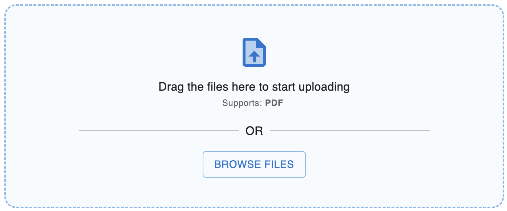

# Material UI File Upload

> <b>NOT AN OFFICAL MUI LIBRARY</b>

Provides components and hooks to upload files which has a Material UI style.

This package is built on [MUI](https://mui.com) and <b>is just meant to be temporary until MUI makes equalivant components</b> Which is on their [roadmap](https://mui.com/material-ui/discover-more/roadmap/) as Dropzone and File Upload.

## Installation

You can install the package using npm or yarn

```
npm install --save mui-file-upload
```

```
yarn install --save mui-file-upload
```

## Overview

Currently the package isn't a simple component. It is consists of multiple components you can put together to build a custom file upload experience.
Please view the storybook for some real world components.

## High customizable

Look at storybook sample code but components and hooks allow for highly customizable UI with the functionality of handling file uploads and file drops easily.

## Components

### High Level
The components in this library are broken down into two types, high & low level.

The following are high level components, which can be used "out-of-box" with little configuration.

#### MultiFileUpload

This uncontrolled component can be used to upload multiple files.


#### SingleFileUpload

This uncontrolled component can be used to upload a single file.


### Low Level


The following are low level components which can be used to create a high level components. 

_(This is how the higher level components above where made)_

#### FileDropzone 

#### FileDropzoneBody & FileDropzoneInputBody


_More details and example will be here in the future._
